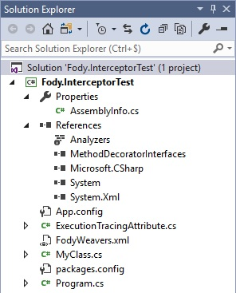
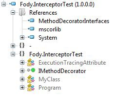

# MSIL Weaving / Fody

Fody propose plus d'une 140aines de packages NuGet couvrant un large scope :
- [NullGuard](https://www.nuget.org/packages/NullGuard.Fody/) : add null checks
- [MethodCache.Fody](https://github.com/Dresel/MethodCache/) : caches return values of methods and properties decorated with a [Cache] Attribute
- [Tracer.log4net.Fody](https://www.nuget.org/packages/Tracer.Log4Net.Fody/) : log4Net adapter for Tracer.Fody which is an ILWeaver adding trace enter and leave log entries to methods
- [Rest.Fody](https://www.nuget.org/packages/Rest.Fody/) : a multi-platform REST client powered by Fody
- [Janitor.Fody](https://www.nuget.org/packages/Janitor.Fody/) : add-in that helps with implementing IDisposable
- [MethodDecorator.Fody](https://www.nuget.org/packages/MethodDecorator.Fody/) : add-in to decorate arbitrary methods to run code before and after invocation
- etc...

Pour une première approche, nous allons voir comment créer un addin custom capable de tracer les temps d'exécution de méthodes (via un attribut `ExecutionTracingAttribute`).

Dans ce cas, nous allons avoir recours au module `MethodDecorator.Fody` afin :
- d'exécuter du code avant l'invocation de la méthode (déclencher le Stopwatch)
- d'exécuter du code lorsque l'invocation de la méthode est terminée (arrêter le Stopwatch et tracer le temps d'exécution au niveau de la console)

Le source de l'exemple ci-dessous peut être récupéré directement sur [ce lien](...).

## Création et initialisation du projet

- Créons un projet Console .NET 4.5 que l'on nommera Fody.InterceptorTest.
- Ajoutons les packages NuGet suivant : Fody & MethodDecorator.Fody.PP.
  Le fichier packages.config contient à présent :
  ```
  <packages>
    <package id="Fody" version="2.4.1" targetFramework="net45" developmentDependency="true" />
    <package id="MethodDecorator.Fody.PP" version="0.9.1.6" targetFramework="net45" />
  </packages>
  ```

  Concernant les références :

  

  - Aucune référence vers Fody car elles ne sont pas nécessaires (il s'agit d'une developmentDependency). Seul MSBuild a connaissance de la dépendance Fody (dans le csproj) pour la tâche post-compile.
  - 

- Ajoutons la classe suivante :
  ```
  namespace Fody.InterceptorTest
  {
    using System;
    using System.Threading;

    class MyClass // la classe pourrait être sealed, ça ne changerait rien
    {
      [ExecutionTracing] // attribut que nous allons implémenter par la suite via un Inspecteur Fody
      public void MyMethod()
      {
        Console.WriteLine("MyClass.MyMethod starts");
        Thread.Sleep(new Random().Next(100, 500)); // simulate instructions...
        Console.WriteLine("MyClass.MyMethod end");
      }
    }
  }
  ```
- Ajoutons l'invocation de la méthode dans la classe Program :
  ```
  namespace Fody.InterceptorTest
  {
    using System;

    class Program
    {
      static void Main(string[] args)
      {
        var myClass = new MyClass();
        myClass.MyMethod();
        Console.ReadLine();
      }
    }
  }
  ```

**Objectif**

L'objectif à présent est de remonter le temps d'exécution de la méthode MyMethod sans rajouter du code, en injectant un comportement à la méthode, au compile-time. \
On peut vouloir tracer l'ensemble des méthodes d'une classe sans pour autant ajouter du code redondant dans chacune des méthodes ou rajouter une responsabilité de logging à la classe...

## Implémentation de l'Interceptor avec Fody

- Ajoutons la classe ExecutionTracingAttribute qui n'est rien d'autre qu'un Attribute (qui serviva à décorer les méthodes à tracer) :
  ```
  [module: Fody.InterceptorTest.ExecutionTracing]
  
  namespace Fody.InterceptorTest
  {
    using System;
    using System.Diagnostics;
    using System.Reflection;

    [AttributeUsage(AttributeTargets.Method | AttributeTargets.Module)]
    class ExecutionTracingAttribute : Attribute, IMethodDecorator
    {
      private MethodBase method;
      private Stopwatch stopwatch;

      public void Init(object instance, MethodBase method, object[] args)
      {
        this.method = method;
        Console.WriteLine($"{this.method.DeclaringType.FullName}.{this.method.Name} > Init");
      }

      public void OnEntry()
      {
        this.stopwatch = Stopwatch.StartNew();
        Console.WriteLine($"{this.method.DeclaringType.FullName}.{this.method.Name} > OnEntry");
      }

      public void OnExit()
      {
        this.stopwatch.Stop();
        Console.WriteLine($"{this.method.DeclaringType.FullName}.{this.method.Name} > OnExit");
        Console.WriteLine($"{this.method.DeclaringType.FullName}.{this.method.Name} > Duration: {this.stopwatch.ElapsedMilliseconds}ms");
      }

      public void OnException(Exception e)
      {
        Console.WriteLine($"{this.method.DeclaringType.FullName}.{this.method.Name} > OnException: {e.GetType()}: {e.Message}");
      }
    }
  }
  ```

## Compilation

Une fois le projet compilé, on obtient le code suivant dans ILSpy : \
(représentation C# car plus concis et compréhensible que MSIL, mais c'est bien l'IL qui est transformé !)

```
public void MyMethod()
{
  MethodBase methodFromHandle = MethodBase.GetMethodFromHandle(methodof(MyClass.MyMethod()).MethodHandle, typeof(MyClass).TypeHandle);
  ExecutionTracingAttribute executionTracingAttribute = (ExecutionTracingAttribute)Activator.CreateInstance(typeof(ExecutionTracingAttribute));

  object[] args = new object[0];

  executionTracingAttribute.Init(this, methodFromHandle, args);
  executionTracingAttribute.OnEntry();

  try
  {
    Console.WriteLine("MyClass.MyMethod starts"); // body de la méthode
    Thread.Sleep(new Random().Next(100, 500));    // body de la méthode
    Console.WriteLine("MyClass.MyMethod end");    // body de la méthode
    executionTracingAttribute.OnExit();
  }
  catch (Exception e)
  {
    executionTracingAttribute.OnException(e);
    throw;
  }
}
```
On remarque que l'intercepteur encadre le body de la méthode, en y ajoutant les méthodes :
1. Init
2. OnEnter
3. OnExit
4. la gestion d'une éventuelle exception sans pour autant l'étouffer (throw).

Si l'on jette un oeil aux références du binaire :



Il n'y a bien aucune référence vers un éventuel runtime Fody.

Note : l'interface `IMethodDecorator` est importé par le package NuGet `MethodDecorator.Fody.VS2015` mais n'a aucune adhérence directe avec Fody.

## Exécution

Sans surprise, le résultat de l'exécution donne :
```
Fody.InterceptorTest.MyClass.MyMethod > Init
Fody.InterceptorTest.MyClass.MyMethod > OnEntry
MyClass.MyMethod starts
MyClass.MyMethod end
Fody.InterceptorTest.MyClass.MyMethod > OnExit
Fody.InterceptorTest.MyClass.MyMethod > Duration: 284ms
```

Pour aller plus loin, on pourrait envisager d'enregistrer les temps d'exécution dans une base / ES pour ensuite monitorer les méthodes pour connaître :
- les moyennes d'exécution
- l'évolution des temps d'exécution au fils des livraisons
- détecter les méthodes coûteuses (pour les optimiser)
- etc...

### Remarque
L'intercepteur par Fody est un exemple.
Plusieurs autres frameworks et librairies permettent de faire la même chose (PostSharp, Unity.Interception (@runtime), etc).
