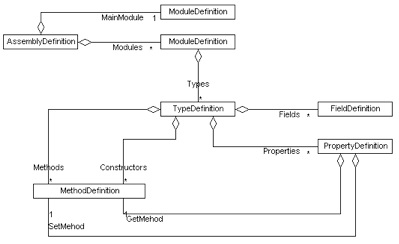

# MSIL Weaving / Mono.Cecil / Exemple simple

Un tutorial assez sympathique est disponible sur [CodeProject](https://www.codeproject.com/Articles/671259/Reweaving-IL-code-with-Mono-Cecil) (Reweaving IL code with Mono.Cecil - source code)

Autre exemple concret : [implémenter l'interface INotifyPropertyChanged](https://codingly.com/2008/11/10/introduction-a-monocecil-implementer-inotifypropertychanged/)

## Cas d'utilisation

Voici un cas simple (et fantaisiste) pour exposer un exemple de ce qu'il est possible de faire avec Mono.Cecil en terme d'IL weaving : modifier les instructions IL d'une méthode dans un binaire .NET.

**Modèle objet de Cecil** \
Le modèle objet fourni par Cecil permet d'inspecter une assembly chargée en mémoire, de parcourir l'ensemble de ses types, méthodes, propriétés, etc.



Supposons que nous utilisons un programme qui vérifie un token pour valider une licence, que nous aimerions valider à coup sûr (le programme est évidemment non obfusqué...).

La validation du token au sein de l'application est effectuée par la méthode HasValidToken de la classe SecurityManager :
```
namespace Application
{
  internal class SecurityManager
  {
    public bool HasValidToken(string token)
    {
      if (token == null)
      {
        return false;
      }

      // here, validation checking...
    }
  }
}
```

L'objectif est donc de court-circuiter le traitement interne de la méthode HasValidToken par quelque chose comme `return true` :)

## Weaver

Pour cela, nous pouvons écrire le weaver suivant :
```
static class PatchWeaver
{
  public static bool Patch(string assemblyPath)
  {
    // load the assembly definition to inspect types, methods, properties...
    var assemblyDefinition = AssemblyDefinition.ReadAssembly(assemblyPath);

    // get SecurityManager type definition
    var securityManagerTypeRef = assemblyDefinition.MainModule.Types.FirstOrDefault(t => t.FullName.Contains("SecurityManager"));
    if (securityManagerTypeRef != null)
    {
      // get HasValidToken method definition
      var hasValidTokenMethodRef = securityManagerTypeRef.Methods.FirstOrDefault(m => m.Name == "HasValidToken");
      if (hasValidTokenMethodRef != null)
      {
        // get the IL processor to transform the HasValidToken instructions
        var processor = hasValidTokenMethodRef.Body.GetILProcessor();

        // remove all instructions inside the HasValidToken method
        processor.Body.Instructions.Clear();

        // create a new instruction that is always true
        // (found at https://github.com/Dresel/MethodCache/blob/master/MethodCache.Fody/CecilHelper.cs)
        var trueInstruction = processor.Create(OpCodes.Ldc_I4_S, Convert.ToSByte(true));

        // add the previous instruction as return one
        processor.Body.Instructions.Add(trueInstruction);
        processor.Body.Instructions.Add(Instruction.Create(OpCodes.Ret));

        // SimplifyMacros & OptimizeMacros -> extension methods from Mono.Cecil.Rocks namespace
        hasValidTokenMethodRef.Body.SimplifyMacros();
        hasValidTokenMethodRef.Body.OptimizeMacros();

        // write the transformed assembly
        assemblyDefinition.Write(
          $"{assemblyPath}.patched.exe",
          new WriterParameters { WriteSymbols = true });

        return true;
      }
    }

    return false;
  }
}
```

La méthode effectue les actions suivantes :

1. recherche le type `SecurityManager` dans l'assembly chargée,
2. recherche la méthode `HasValidToken` sur le type SecurityManager,
3. récupère le processeur IL sur la méthode HasValidToken afin de pouvoir en manipuler le body,
4. supprime l'ensemble des instructions IL définies dans la méthode,
5. ajoute une instruction de type Return qui renvoie `true`,
6. enregistre la nouvelle assembly.

Une fois le traitement réalisé, nous obtenons la nouvelle assembly transformée (ILSpy - représentation C# pour plus de clareté sur MSIL) :

```
internal class SecurityManager
{
  public bool HasValidToken(string token)
  {
    return true;
  }
}
```

L'exemple se voulait bête et extrêment simple, mais il montre qu'il est possible de manipuler un binaire existant au travers d'un modèle objet relativement intuitif, de le manipuler, de le transformer et de l'enregistrer pour créer le nouveau binaire.

La création d'instructions IL reste cependant pas très évidente (AMHA).

**Création d'instructions IL** \
Une façon simple de créer les instructions IL est d'écrire le code C# attendu en résultat, de le compiler et d'utiliser ILSpy pour en lire le code IL, pour s'en servir ensuite de modèle.

Le projet Fody (wrapper Mono.Cecil) et ses différents addins peuvent être fort utiles pour se familiariser avec la création d'instructions IL (cf. [CecilHelper.cs](https://github.com/Dresel/MethodCache/blob/master/MethodCache.Fody/CecilHelper.cs) par exemple).